# DevOps Overview

A basic overview of how development and operations works and this can become DevOps.

* Build your app on your local laptop and it is only accessible on your laptop.

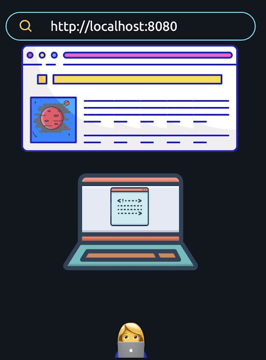

* You need to host your app on a server that is never turned off and connected to the internet with a static IP address.
* You need to copy to the server  your application binary, its depedencies (e.g. runtimes and libraries), and also configure the server so it can run your application.
* Your laptop is now the development environment and the server is your production environment.

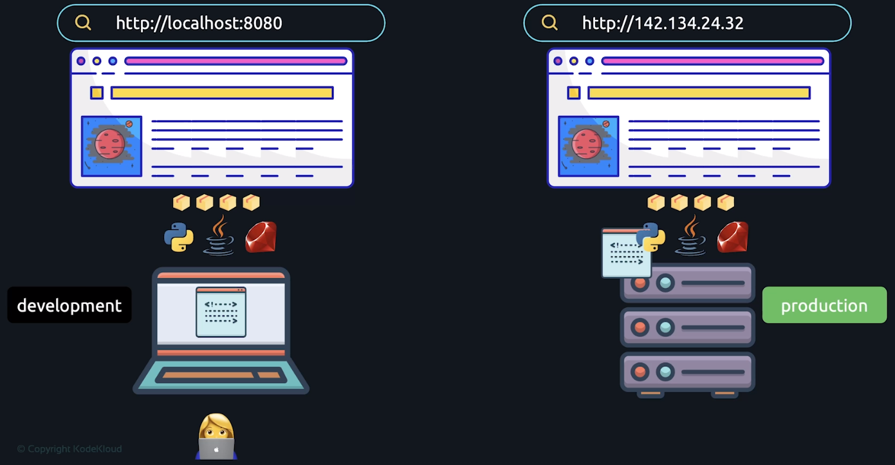

* You don't want your users to have to remember the IP address of your server hosting your application so you need to buy a domain and configure DNS to point your IP address to your domain.
* Users can now connect to the application hosted on your server via the domain name.

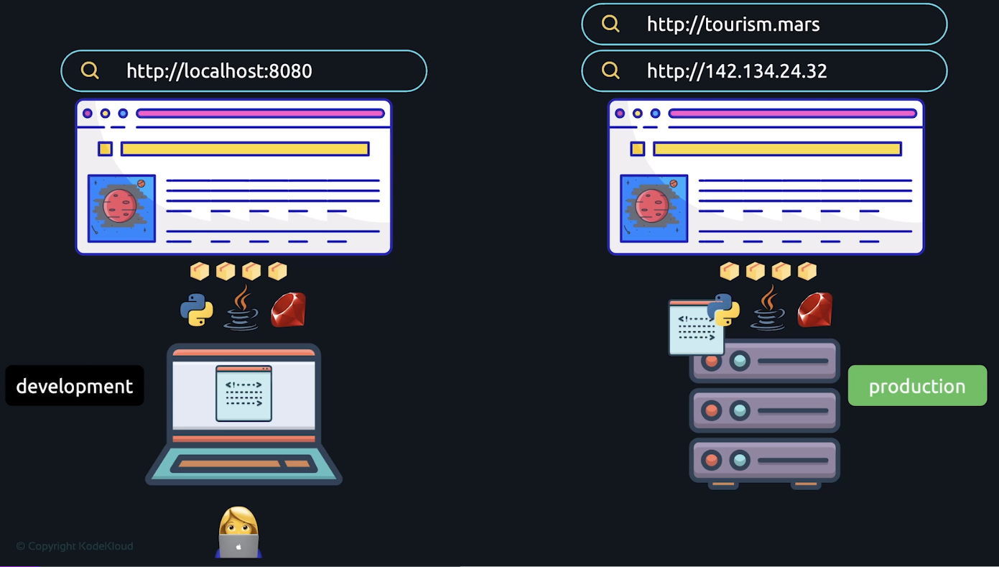

* At a high level there are 3 steps in DevOps
  1. Developing - coding the application.
  2. Building - converting the application code into an executable application binary.
  3. Deploying - copying the application binary and dependencies to where it will run.
* You can do these steps manually or automatically. You should do it automatically.

* When multiple developers work on the same application you need a way to manage them working on the same files at the same time. This is where `git` comes in.
* `git` is a centralised code repository that allows multiple developers to work on the same code base as the same time. Each develop has their own local copy of the code and when they are ready to share with the team they will push their copy to the centralised copy. Everyone else can now pull their changes and merge them into their code.
* The central `git` repository is typically located on the internet at somewhere like GitHub, GitLab, or Bitbucket. These are webapps with GUI front ends for working with `git`.

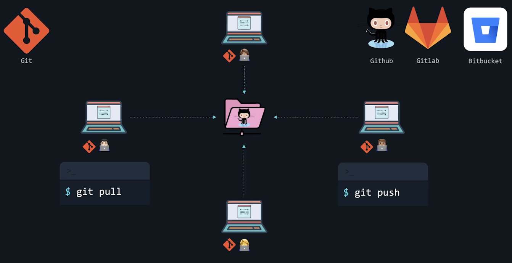

* When you have multiple developers working on the application you need to have a central location for building as well. The code from the central `git` repository is used on the build server.
* You should never push untested builds into production so all builds should be tested. A test server or test environment is needed to do this.

* There are 2 types of CI/CD.
  1. Continuous integration / continuous delivery.
  2. Continuous integration / continuous deployment.
* **Continuous integration** is the practice of commiting your code changes into the main branch of the shared source code as often as possible, automatically testing each change upon commit or merge, and automatically building after a successful test.
* **Continuous delivery** automatically deploys the successful build into the test (or higher) environment. But a manual deployment into production is done.
* **Continuous deployment** automatically deploys the successful build into all higher environments.

* There are many CI/CD tools like Jenkins, GitHub actions, GitLab CI/CD.
* CI/CD tools faster builds and deployments into higher environments.

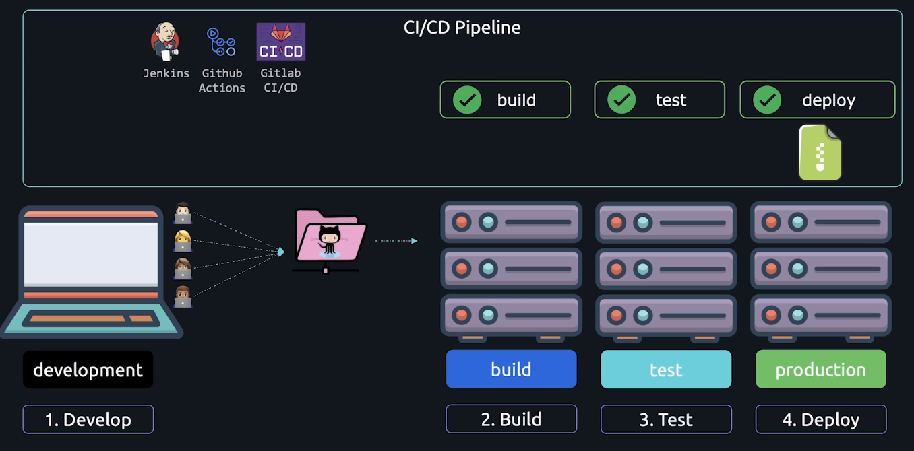

* A common problem with application deployments into multiple runtime environments is every runtime environment needs to be configured exactly the same for the application to run. It is difficult to ensure multiple environments are configured the same way.

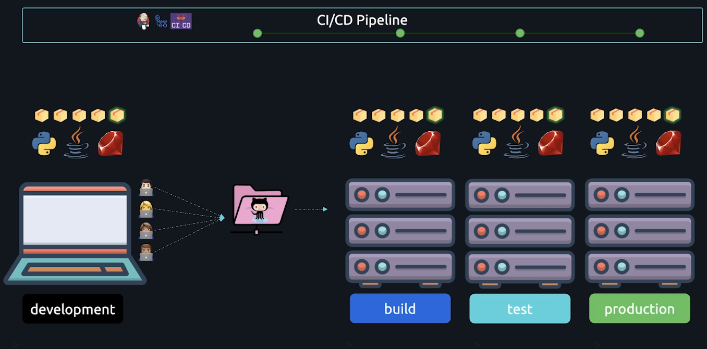

* A common solution to application deployments into multiple runtime environments is to package the application into a container image. The container image is an isolated runtime environment that houses the application and all of its dependencies.
* The container image is automatically built during the build phase and makes deployment into higher environments much easier.
* Docker was the first tool to make Linux containers popular, but there are many tools now.

* Containers also provide an easy way to run multiple instances of the same application at once, across 1 or many servers.
* A problem with running multiple containers is how do you manage it correctly when you need more container instances, less container instances, or restarting failed container instances.

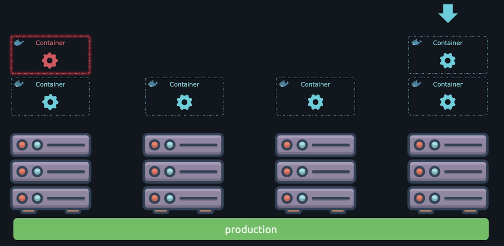

* Container orchestration platforms automatically manage containers for you and make deploying and managing multiple containers easy.
* Kubernetes is a popular container orchestration tool.

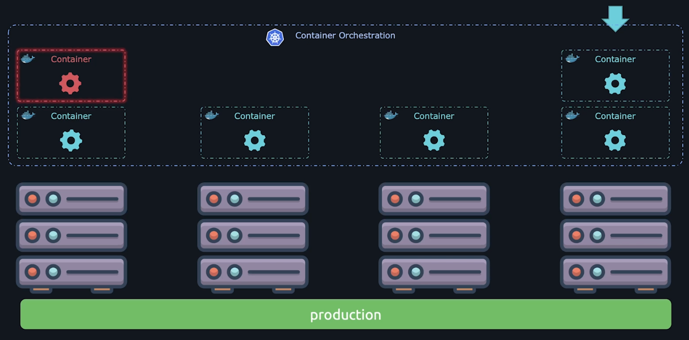

* A lot of servers are required to set up a CI/CD pipeline and they all need to be configured in a consistent manner. Just like manually building and deploying an application, manually provisioning and configuring servers is repetitive, time consuming, and error prone.

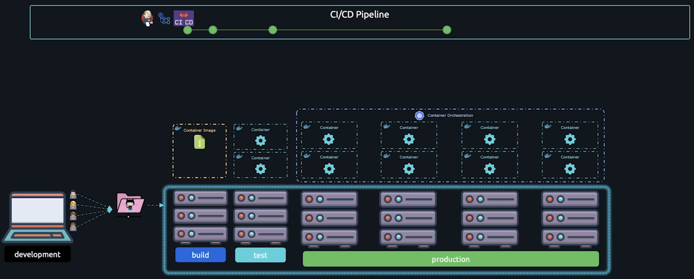

* There are tools that can be used to automate the provisioning and configuration and servers. Common tools are Terraform and Ansible.

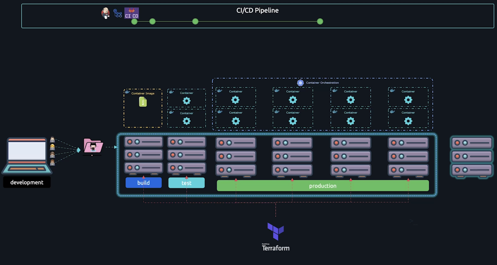

* Servers are provisioned and configured by writing code. This is called **Infrastructure as Code (IaC)**. This code is checked into the `git` repository.

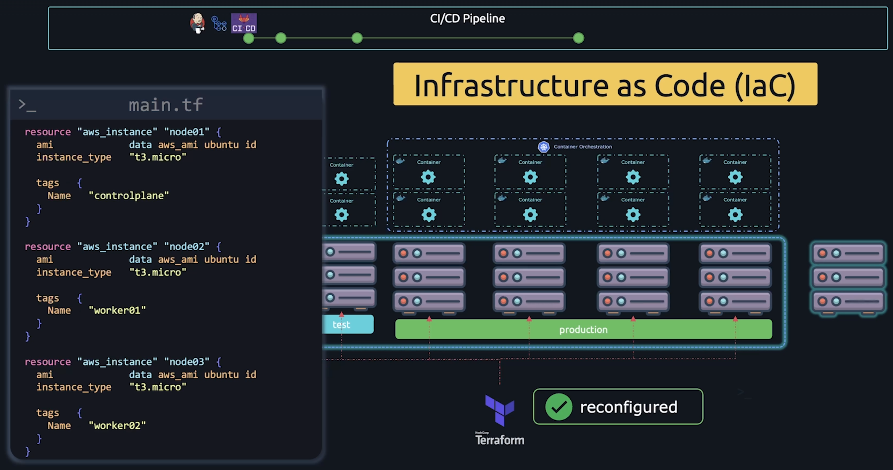

* A common usage pattern is to use Terraform to provision the server and Ansible to configure the server.

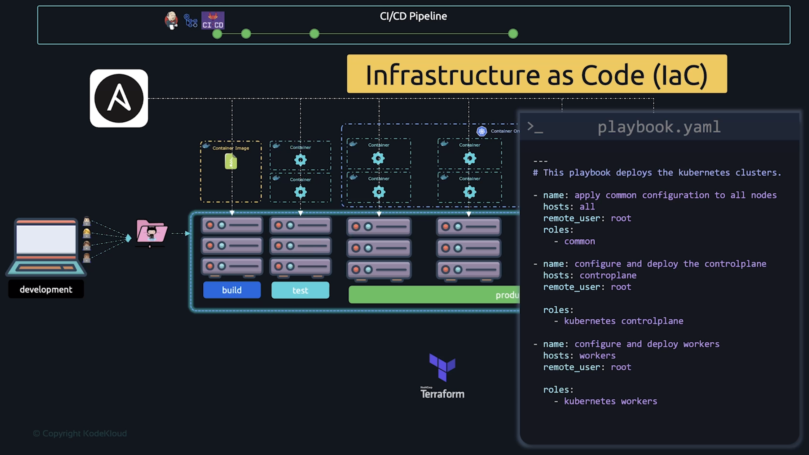

* There is a lot of infrastructure running and we need to make sure that it keep running by monitoring it. Prometheus is a common tool for monitoring infrastructure logs.

* Grafana is a common tool for visualising monitored infrastructure logs.

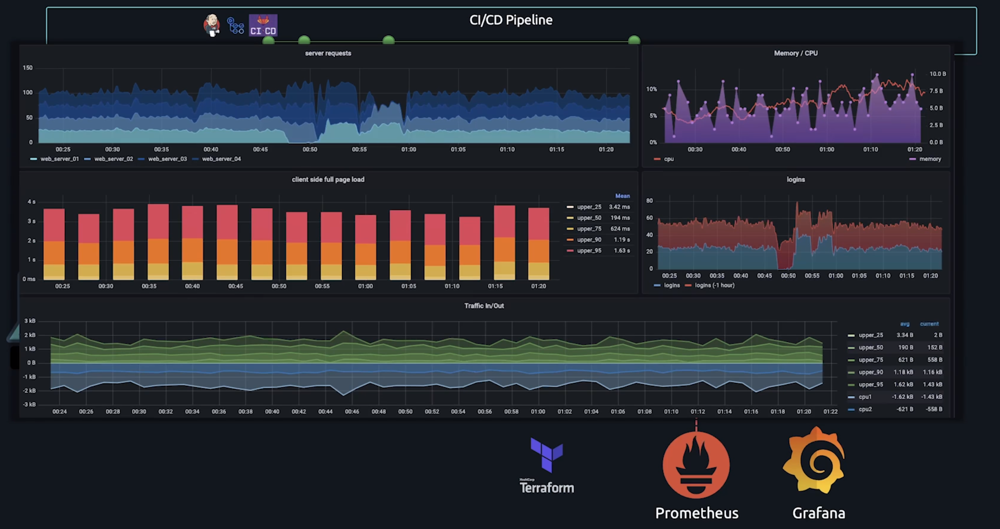

* All of these tools create the DevOps loop. **DevOps** is a set of practices, tools, and a cultural philosophy that automate and integrate the processes between software development and IT teams. It enables software development (dev) and operations (ops) teams to accelerate delivery through automation, collaboration, fast feedback, and iterative improvement.

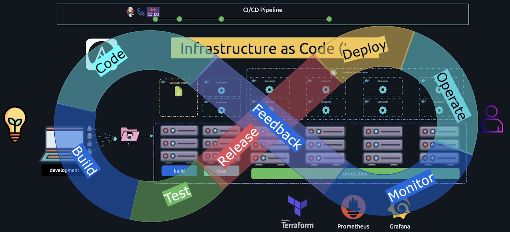

