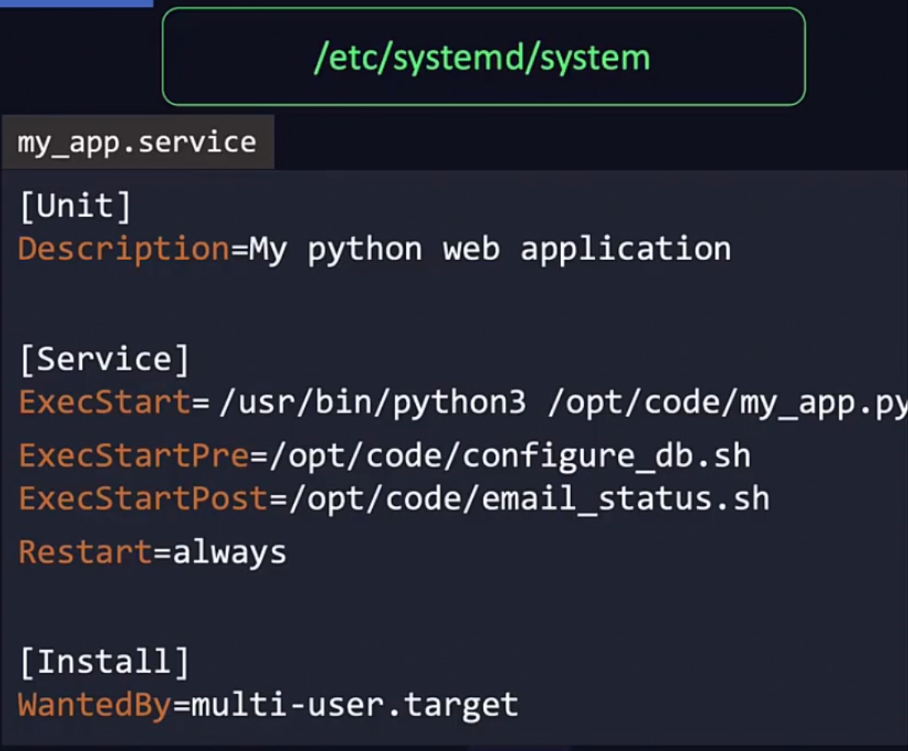

# Linux Basics

I basically knew all of this already from the excellent free book at https://linuxcommand.org/tlcl.php and other resources. So the only thing documented here is course specific or something I didn't know.

* Linux skills are needed because DevOps is pretty much done on Linux. e.g. Docker, Kubernetes, etc.


* CentOS was chosen as the Linux distribution as its a free version of RHEL. But now it should be substituted with Alma Linux or Rocky Linux.

```bash
# Download file with curl using existing filename
curl $URL -O

# Download file with wget using existing filename
wget $URL

# Download file with wget using a new filename
wget $URL -O $NEW_FILENAME
```

RPM (Red Hat Package Manager) doesn't install dependencies. This is why `yum` and `dnf` exist. They use `rpm` under the hood.

```bash
# Install a package
rpm -i $RPM_FILE

# Uninstall a package
rpm -e $RPM_FILE

# Query the package database for package information
rpm -q $RPM_FILE

# Yum repos are found at
/etc/yum.repos.d/
yum repolist

# Show all package versions
yum --showduplicates list $PACKAGE

# Install a specific package version
yum install $PACKAGE-$VERSION
```

* Services are started in a specific order, as some services depend on other services.
* `service` uses `systemctl` under the hood on a SystemD system.
* `systemctl daemon-reload` tells SystemD to reread all service files.
* SystemD service file syntax:
  * `ExecStart=$CMD` is the command to run.
  * `ExecStartPre=$CMD` is the command to run before `ExecStart=$CMD`.
  * `ExecStartPost=$CMD` is the command to run after `ExecStart=$CMD`.
  * `WantedBy=$TARGET` is when the service will start.
  * `Restart=always` is to restart the app if it exits.




