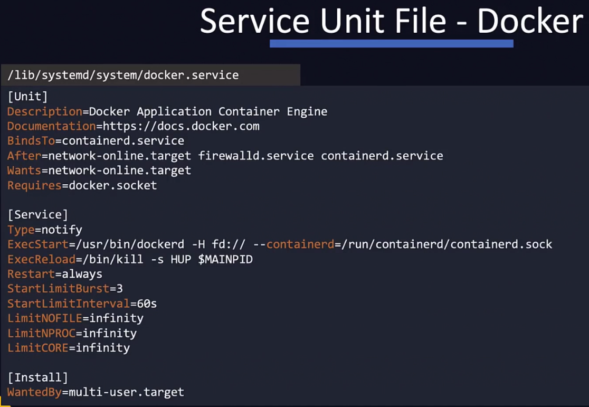

# Linux Basics

I already knew all of this from the excellent free book at https://linuxcommand.org/tlcl.php but I have created screenshots anyway.

* Linux skills are needed because DevOps is pretty much done on Linux. e.g. Docker, Kubernetes, etc.

* CentOS was chosen as the Linux distribution as its a free version of RHEL. But now it should be substituted with Alma Linux or Rocky Linux.
* There is a variety of shells and they each have a different way of doing things. Bash is the most common.

