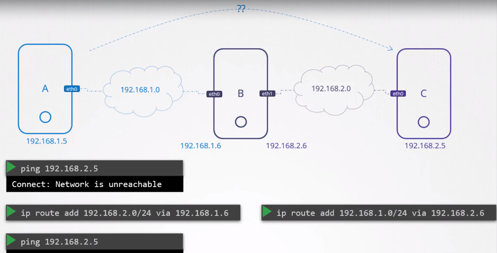

# Network Basics

I basically knew most of this already from the excellent [CKAD](https://github.com/dallas-hall/learning-containers-and-orchestration/tree/main/kubernetes/02.applications-developer), [CKA](https://github.com/dallas-hall/learning-containers-and-orchestration/tree/main/kubernetes/03.administrator), and [CKS](https://github.com/dallas-hall/learning-containers-and-orchestration/tree/main/kubernetes/04.security) courses that I did. So the only thing documented here is course specific or something I didn't know.

```bash
# View the host interfaces
ip link

# View the host IP addresses
ip addr

# Add an IP address to an interface
ip addr add $IP_ADDRESS dev $INTERFACE
```


* A router needs to have an IP address assigned to it from each network it is connecting.


```bash
# Add a gateway route
ip route add $TARGET_CIDR via $ROUTER_IP
```

* The gateway needs to be configured on all systems.


* The default gateway also needs to be configured on all systems.


* The above networking routing can be simplified to the picture below.
*`default` and `0.0.0.0` entries in the Destination field means the same thing, which is route any unknown IP address to the default gateway. So the first 2 lines in the above picture mean the same thing.
* The `0.0.0.0` entry in the Gateway means that you don't need a gateway. This is to handle internal private network between devices within the same network.


* By default in Linux packets are not forwarded between interfaces. This is a security feature.



* You can check packet forwarding between interfaces at `/proc/sys/net/ipv4/ip_forward` and you can permanently toggle it in `/etc/sysctl.conf` via the `net.ipv4.ip_forward` entry.

