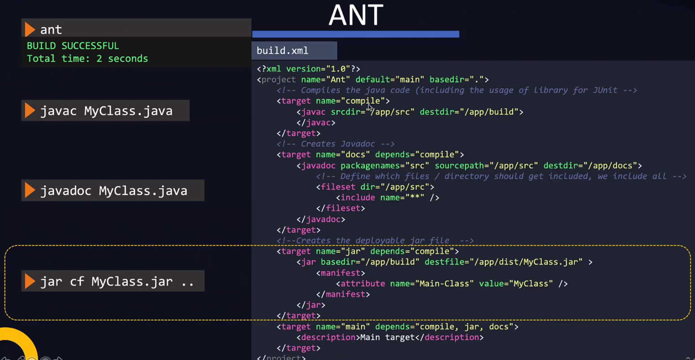

# Application Basics <!-- omit in toc -->

I knew some of this from learning to program in Java and Python but I NodeJS was all new to me. So the only thing documented here is course specific or something I didn't know.

## Table of Contents <!-- omit in toc -->

- [Overview](#overview)
- [Java](#java)
- [NodeJS](#nodejs)
- [Python](#python)

## Overview


* Interpretted languages are implicity compiled into byte code and then run.
* Without byte code the program can only run on the CPU architecture it was compiled on. So applications had to be compiled on all of the CPU architectures that they would run on.


* Modern programming languages compile into byte code which can then be run on any CPU architecture by the interpretter.


* Files containing Python byte code have the extensions `.pyc`
* The Python byte code files are run by the Python interpretter inside of a virtual machine. This is not the same as infrastructure VMs.
* The Python VM is responsible for translating the byte code into the required machine code.
* All of this happens in the background when you execute the program.


* Code that can be reused by anyone is either known as packages, libraries, or modules.
* If packages are used in a program they must be installed alongside the program as the program is dependent upon them to run. They are known as dependencies.
* Packages are availabe through package managers, such as `pip` for Python.


* CI/CD pipelines automate the repeated processes in software development, such as build (i.e compile), test, package, and deploy.

## Java

My Java code from learning Java can be found [here](https://github.com/dallas-hall/learning-java).

* Java 9 made a lot of backwards incompatible changes which is why a lot of apps are stuck at Java 1.8.
* The naming scheme for Java dropped the 1 dot after version 9, so instead of Java 1.9 it became Java 9.


```bash
# Add the Java install path to PATH so the binaries are available
export JAVA_HOME=/path/to/jdk-install
export PATH=$JAVA_HOME/bin:$PATH
```

* Java 9 also introduced the bundling of the JRE inside of the JDK. Java 1.8 and earlier required the JDK and JRE to be installed separately.


* Java source code is compiled into Java byte code that can run on any CPU architecture that the Java Virtual Machine (JVM) supports.
* This enables Java apps to built once and run anywhere with a JVM.


* A Java Archive (JAR) file is used to package Java applications.


* A Web Archive (WAR) file is used to package Java applications and their web assets (e.g. HTML and CSS files).
* The `META-INF/MANIFEST.MF` is a metadata file. One thing it contains the entry point (`Main-Class:`) for the application.
* The entry point for a Java application is the Java class that contains the `main` method which executes the entire program.


* Simple Java apps can easily be built manually.


* Large Java apps are complicated and should be built using build tools like Ant Maven, or Gradle.
* Build tools contain configuration files where you can specify the steps to build the application in a repeatble manner.




## NodeJS

* JavaScript was traditionally used for clientside web applications in the browser. It was used to build a variety of clientside frameworks.


* NodeJS is the way to run JavaScript outside of a web broswer. Allowing JavaScript to be used in the backend.
* It can handle a large number of concurrent connections by implementing a non-blocking model.
* https://nodejs.org/en/download/ explains how to install on various platforms

```bash
# Check the NodeJS version
node -v

# Run an app
node $APP_PATH
```


* `npm` is the NodeJS Package Manager.
* It has code from the core team as well as the community.


```bash
# Check the npm version
npm -v

# Search for a package
npm search $NAME

# Install a package locally inside the current directory
npm install $NAME

# Install a package globally into the operating system
npm install $NAME -g
```


* The `package.json` file for the package contains the package metadata for the installed package, including dependencies


* Pacakges can either be installed locally into `$APP_PATH/node_modules/$PACKAGE` or globally into `/usr/lib/node_modules/$PACKAGE`.
* When installing a package locally NPM installs into the current directory as it assumes that is your applications workspace.
* `node -e "console.log(module.paths)"` shows all the filesystem paths that will be checked for installed packages.


* There are 2 types of modules:
  1. Builtin modules which are installed automatically. They are installed into `/usr/lib/node_modules/npm/node_modules`
  2. External modules that need to be installed manually. They are installed into `/usr/lib/node_modules/`


* The `package.json` file for the project contains the package metadata for the project, including dependencies


## Python

My Python code from learning Python can be found [here](https://github.com/dallas-hall/learning-python).

* Python 2 and Python 3 were available side by side until Python 2 was deprecated in January 2020. They are not compatible and on older systems you may see Python 2, Python 3, or both installed.


* `pip` is the package manager in Python. It is installed automatically when Python is installed.


* Global Python packages are installed into `/usr/lib/$PYTHON_VERSION/site-packages/` or `/usr/lib64/$PYTHON_VERSION/site-packages/`.
* Run `python -c "import sys; print(sys.path)"` to view where Python will search for packages. This is where the `import` statement will look for packages.


* There are other ways to create and install Python packages that were around before `pip`.
* `setuptools` is used to create Python package files. It create Egg package files with the `.egg` extensions and Wheel package files with the `.whl` extension. They are conceptually similar to `.jar` in Java.
* `easy_install` can work with `.egg` files. They don't need to be unpacked before use.
* `wheels` can work with `.whl` files. They need to be unpacked before use.

