# Git <!-- omit in toc -->

I knew some of this from university and work. So the only thing documented here is course specific or something I didn't know.

## Table of Contents <!-- omit in toc -->

- [Command Cheat Sheet](#command-cheat-sheet)
- [1) Introduction](#1-introduction)
- [2) Branches](#2-branches)
- [3) Remote Repositories](#3-remote-repositories)

## Command Cheat Sheet

```bash
# Show help
git --help

# Show command specific help
git help $CMD

# Create a new local git repository
cd $WORKSPACE
git init

# View the current repo status
git status

# Add work to the staging area
git add $FILE
git add $PATH

# Add all work to the staging area
git add .

# Add your name and email so your commits can be identified
git config user.name $NAME
git config user.email $EMAIL

# Commit work
git commit
git commit -m $COMMIT_MSG

# Undo unstaged changes to committed files
git restore $FILE

# Undo modifications after a file has been staged.
git restore --staged $FILE

# Untrack a file without deleting it
git rm --cached $FILE

# Untrack a file and delete it
git rm -f $FILE

# View the repo history
git log

# Create a new branch and stay on to the current branch
git branch $BRANCH

# Create a new branch and switch to that branch
git branch -b $BRANCH

# Change branches
git checkout $BRANCH

# View all local branches
git branch

# View all local and remote branches
git branch -a

# Delete a local branch
git branch -d $BRANCH

# Merge a branch into master
git checkout master
git merge $BRANCH_MERGE
```

## 1) Introduction

* Git is a content tracker because it stores all of the code and assets.

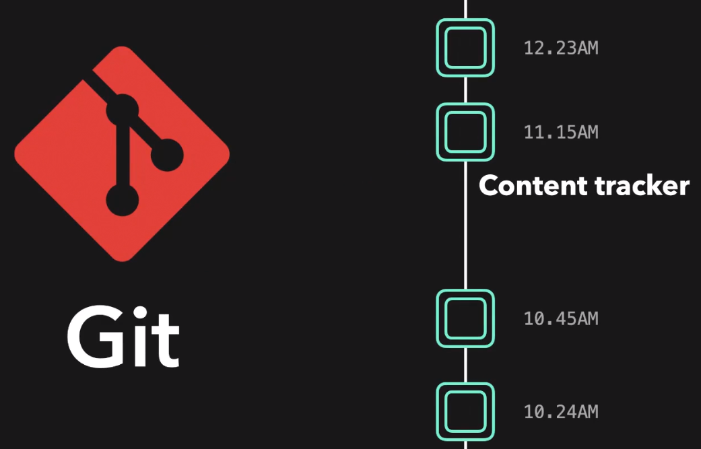

* Git is also a distributed version control system because there are multiple copies of the code on different systems.


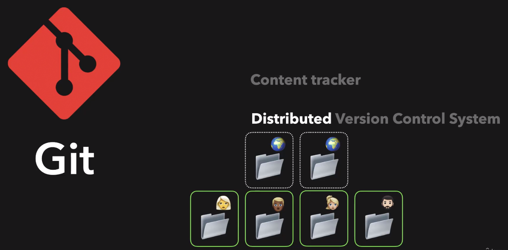

* A version control system means we can go back in time to view the project exactly how it was. The entire project history is there.

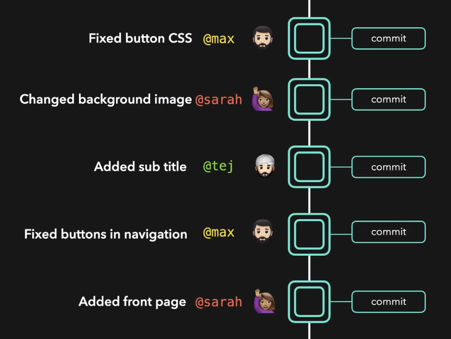

* Git allows you to make changes without losing your current work. You do this through branches.


* Local repositories are stored on developer machines.
* Remote repositories are stored on servers.
* Code is pushed from local repositories to the remote repository and code is pulled from the remote repository to local repositories.

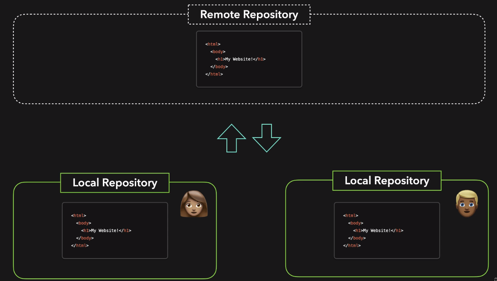

* The local repository has 3 areas
  1. The working area is for active or completed work that Git hasn't been told to do anything with. These are known as untracked files.
  2. The staging area is for completed work that will be committed soon.
  3. The commited area is for all completed work. This work is tracked by Git and storing work is called committing.

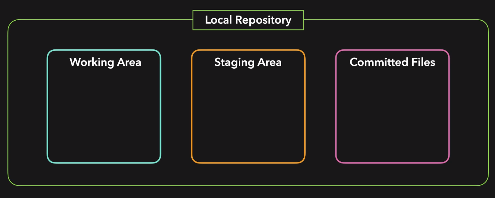

* A commit stores the changes of the file compared to its previous state. The first commit will compare to a blank commit, so everything is new.
* Ideally each commit should be atomic, meaning it is only adding or updating one thing. This will maintain a clean history for the project.

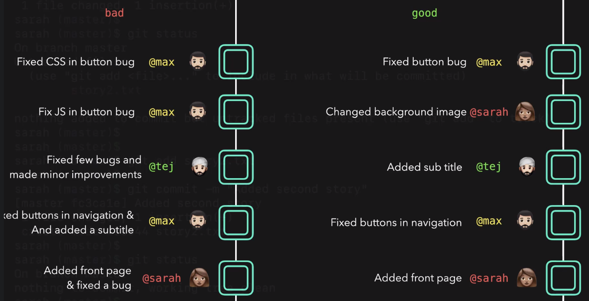

* Git stores a cached version of files when they are staged. If you make modifications after staging Git will detect this.

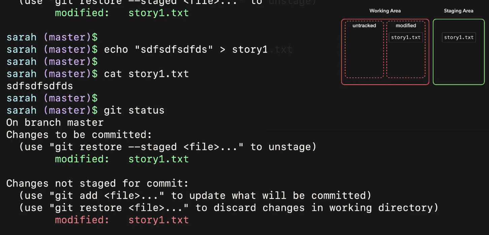

* `.gitignore` can be used to tell Git to not track specific files or folders. This file should be tracked with Git.

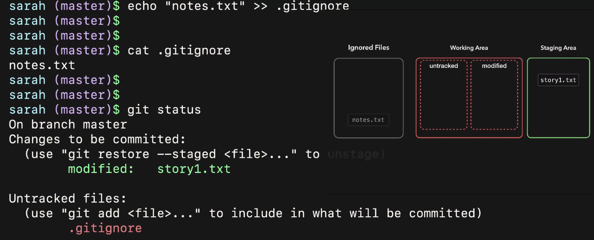

* You can view the repo history from the log.

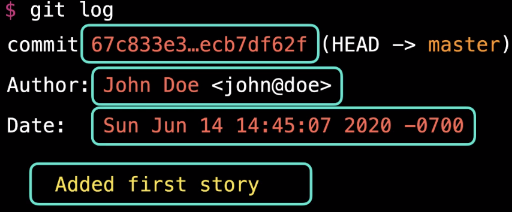

* And remember this bad boy https://stackoverflow.com/a/35075021

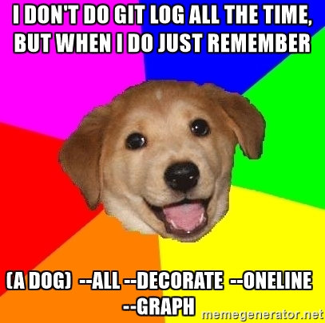

## 2) Branches

* Generally you don't want to work on the master branch, you want to work on separate branches.

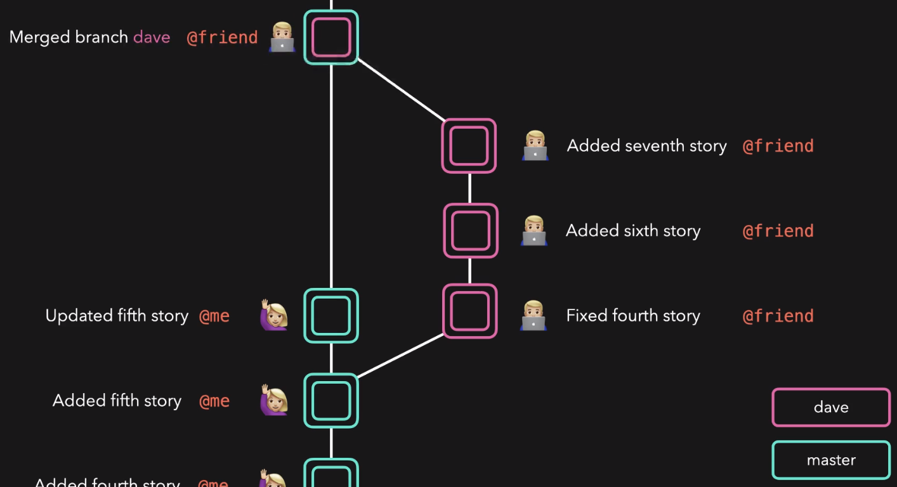

* The changes are then mergeed into master after the changes have been completed and passed testing.

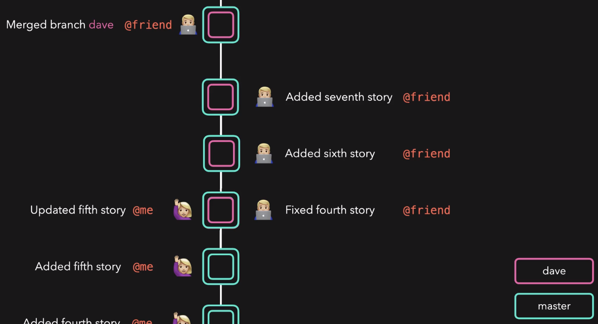

* Some common branch names are:
  * `master` or `main`
  * `develop` or `development`
  * `release`
  * `feature/$NAME`
  * `bugfix/$NAME`

* Branches are nothing more than a pointer to a certain commit.
* The `HEAD` is a pointer to where you are right now in the Git repo. By default this is the last commit on the currently checked-out branch.

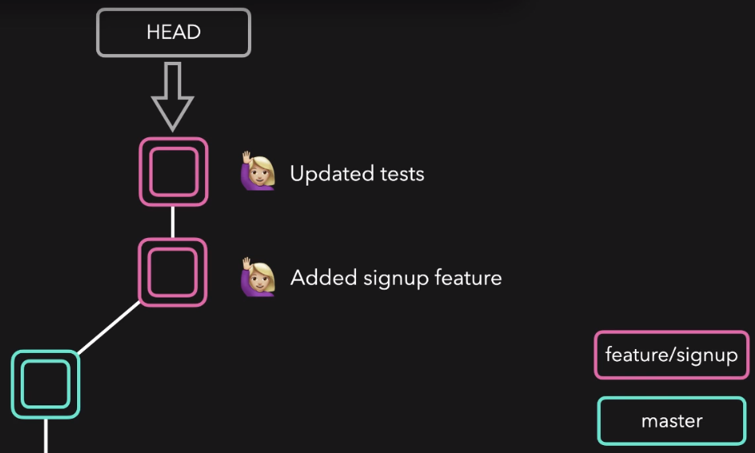

* There are 2 types of merges.
  1. Fast forward merge. This happens when the current branch has no extra commits than the branch we are merging.
  2. No fast forward merge.

* A fast forward merge happens when the current branch has no extra commits than the branch we are merging.

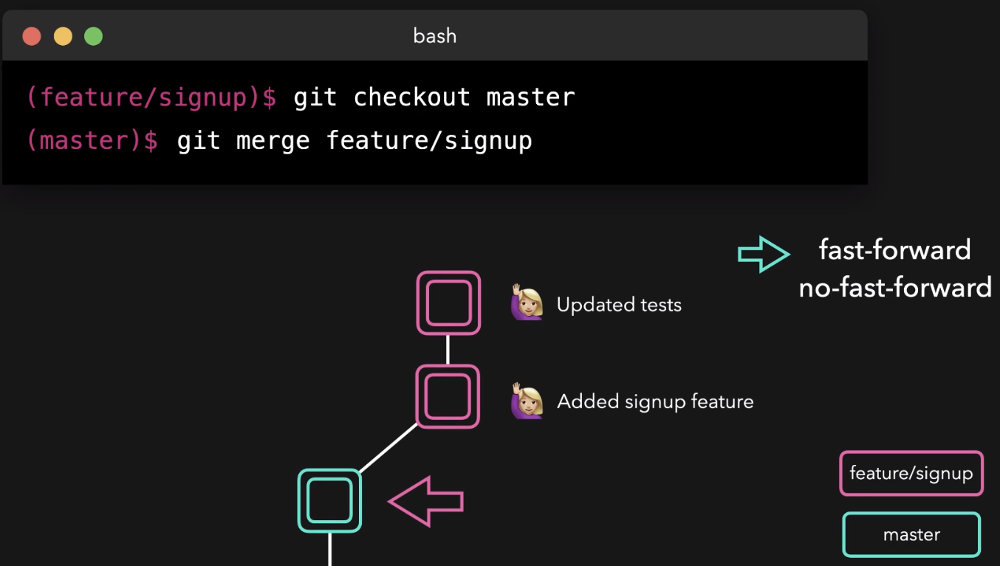

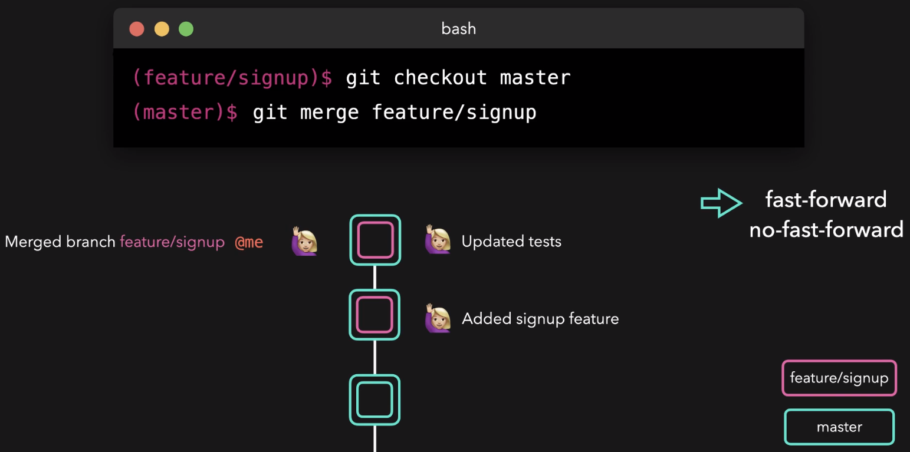

* A no fast forward merge happens when the current branch has extra commits than the branch we are merging. This is common.

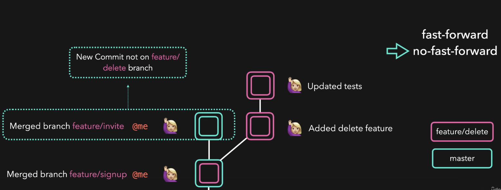

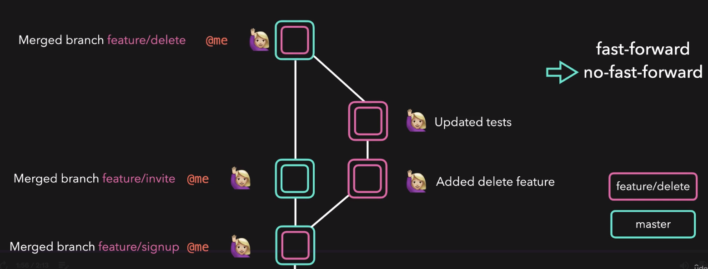

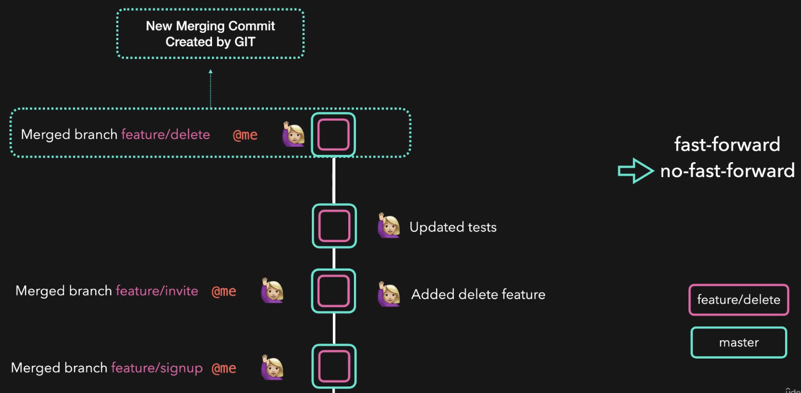

## 3) Remote Repositories


