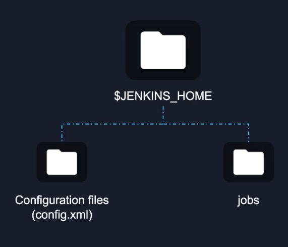
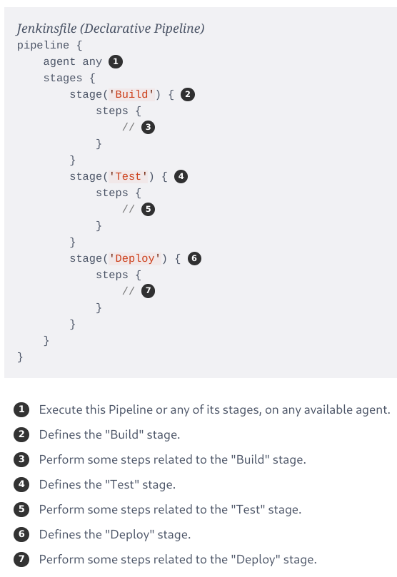
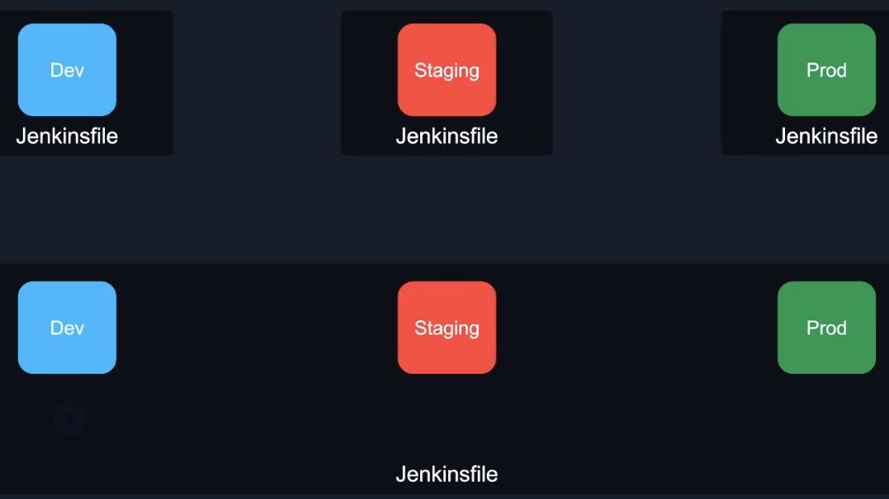

# Jenkins <!-- omit in toc -->

I knew some of this from work. So the only thing documented here is course specific or something I didn't know.

## Table of Contents <!-- omit in toc -->

- [What Is CI/CD?](#what-is-cicd)
- [Why Jenkins?](#why-jenkins)
- [Installing Jenkins](#installing-jenkins)
- [Plugins](#plugins)
- [Administrative Tasks](#administrative-tasks)
- [Pipelines](#pipelines)

## What Is CI/CD?

* CI/CD is covered [here](01-intro.md).
* Security scans should happen after CI.

## Why Jenkins?

* Jenkins is commonly used to create CI/CD pipelines.
* Some good things about Jenkins:
  * It is free.
  * Has a lot of plugins as it is open source and has been around for a long time.
  * Has enterprise support available.

## Installing Jenkins

* Jenkins is really easy to install. See https://www.jenkins.io/doc/book/installing/ for a variety of options.
* Jenkins can be controlled by the GUI or the CLI. The CLI is available via `curl`. Go to Manage Jenkins > Jenkins CLI and follow the steps. You will typically use the GUI to manage Jenkins.

## Plugins

* Plugins allow you to extend the functionality of Jenkins. e.g. connecting to other services.
* Plugins can be found via the [Plugin Index](https://plugins.jenkins.io/) and installed via the Jenkins GUI or CLI.
* There are plenty of plugins for Jenkins.
* Some plugins require a restart after installation.

## Administrative Tasks

* You need to be able to backup, restore, monitor, scale, and manage Jenkins.
* Jenkins can do a variety of backups. See https://www.jenkins.io/doc/book/system-administration/backing-up/ for details.
* The main thing to backup is the `$JENKINS_HOME` folder which contains the app configuration and pipeline coniguration.

## Pipelines

* A **Jenkins Pipeline** (or simply "Pipeline" with a capital "P") is a suite of plugins which supports implementing and integrating continuous delivery pipelines into Jenkins.
* A `Jenkinsfile` is a text file that contains the definition of a Jenkins Pipeline and is checked into source control.
* A **node** is a machine which is part of the Jenkins environment and is capable of executing a Pipeline.
* A **stage** block defines a conceptually distinct subset of tasks performed through the entire Pipeline (e.g. "Build", "Test" and "Deploy" stages), which is used by many plugins to visualize or present Jenkins Pipeline status/progress.
* A **step** tells Jenkins what to do at a particular point in time.

* A multi-stage pipeline which combines all stages into a single `Jenkinsfile`. This just means you have multiple stages within the `Jenkinsfile`.

* By default all pipelines are under the `/var/lib/jenkins/workspace/$PIPELINE_NAME` folder.
