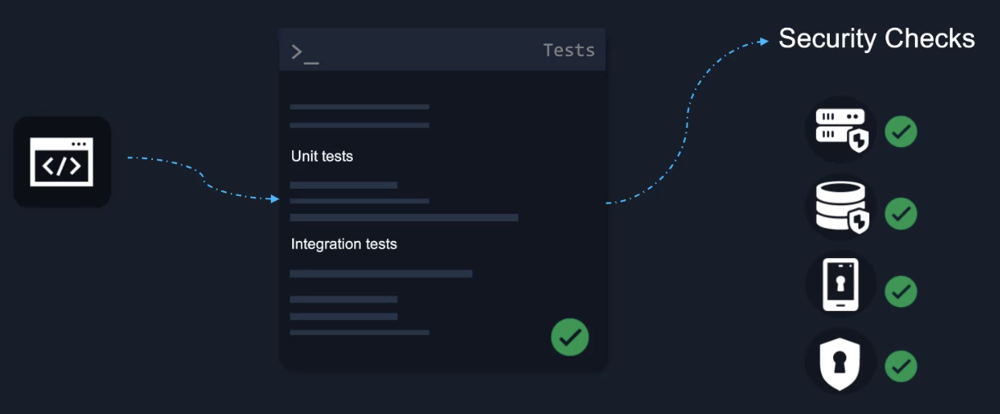

# Jenkins <!-- omit in toc -->

I knew some of this from work. So the only thing documented here is course specific or something I didn't know.

## Table of Contents <!-- omit in toc -->

- [What Is CI/CD?](#what-is-cicd)
- [Why Jenkins?](#why-jenkins)

## What Is CI/CD?

CI/CD is covered [here](01-intro.md).

Security scans should happen after CI.

## Why Jenkins?

Jenkins is commonly used to create CI/CD pipelines.

Some good things about Jenkins:
* It is free.
* Has a lot of plugins as it is open source and has been around for a long time.
* Has enterprise support available.

