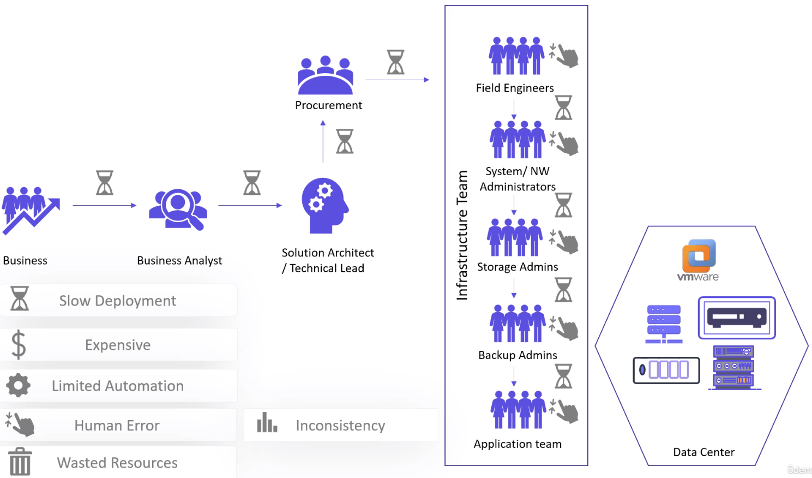
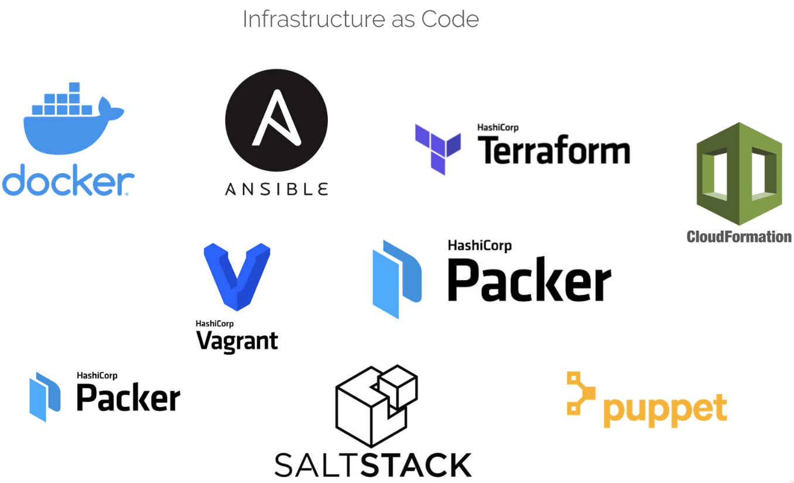
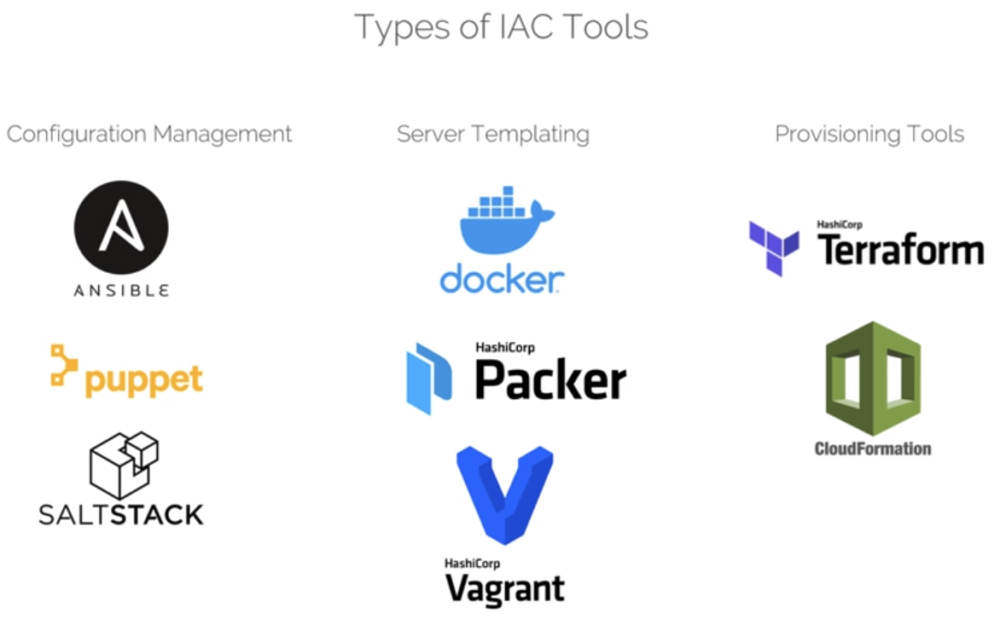
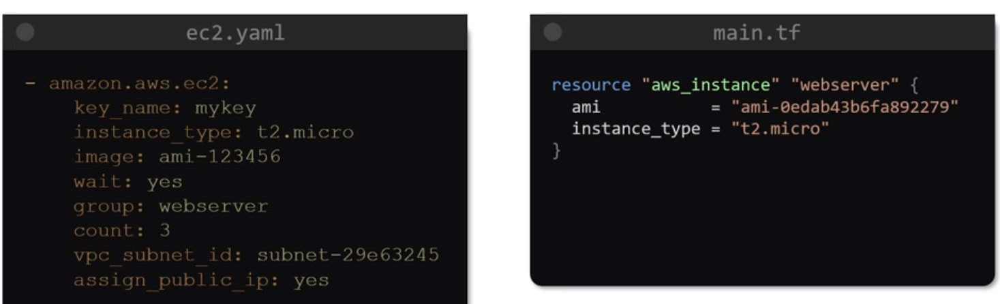
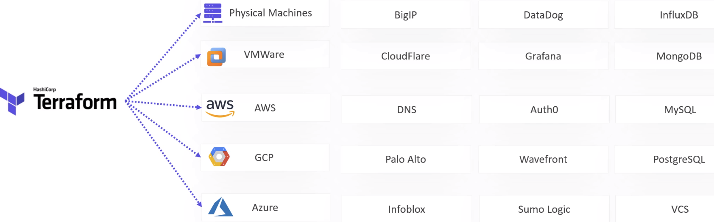
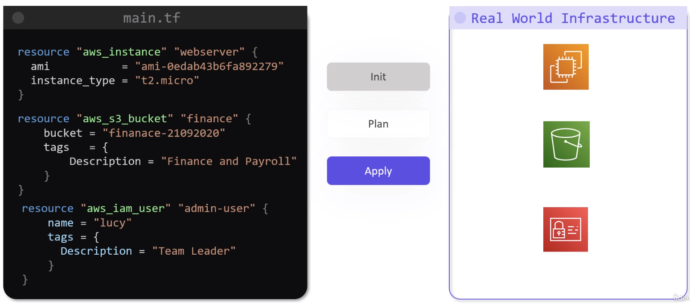

# Terraform <!-- omit in toc -->

I knew nothing when doing this course so the notes will be verbose.

- [1) Infrastructure as Code (IaC)](#1-infrastructure-as-code-iac)
  - [1.1) Types Of IaC](#11-types-of-iac)
  - [1.2) Why Terraform?](#12-why-terraform)

## 1) Infrastructure as Code (IaC)

The tradational infrastructure devlivery model has a lot of different teams working linearly to design, purchase, and build infrastructure. A typical model is:
* The business gives the requirements.
* The business analysts converts these into high level technical requirements.
* The solution architects design the architecture to build and run the requirements.
* The procurement team will order and purchase the required hardware.
* The infratructure teams will then build and configure the hardware in the data centre.
* The application team will build the software.
* The operations team will deploy and maintain the software.

There are a number of disadvantages to this approach.
* It can take a long time to complete this lifecycle.
* Since there are many teams and people involved there is high chance for errors and delays.
* There is little room for automation to speed up the processes.
* Systems are typically built with peak performance in mind which can lead to wasted compute resources. Virtualisation and containerisation has improved this though.

> **NOTE:** On-premise infrastructure can be cheaper or more expensive than the cloud. This depends on the size and complexity of the organisation.

Using virtualisation on-premise or in the cloud gives a big advantage of enabling infrastructure and operations teams access to the platform APIs. **Infrastructure as Code (IaC)** is using code to call these APIs to provsion and configure the servers and software, and this code is checked into the `git` repository so it can be reused. There are a lot of IaC tools.

### 1.1) Types Of IaC

There are 3 types of IaC tools.
1. Configuration management tools, used to control the state of systems.
2. Server templating tools, used to create and configure server software that runs inside of a container or a virtual machine.
3. Provisioning tools, used to create and configure private or public cloud servers.

Ansible and Terraform can both do provisioning. But typically Terraform is used for provisioning and Ansible is used for Configuration Management.

### 1.2) Why Terraform?

It is a free and open source tool that supports multiple public and private cloud environments as well as software stacks. It does this via the product's or service's API through objects called Providers.

It uses a simple declarative language to provision and configure things. This language is called **Hashicorp Configuration Language (HCL).**

Terraform goes through 3 stages when applying HCL.
1. Init: initialises the project and identifies the Providers to use.
2. Plan: creates a plan to get to the desired state.
3. Apply: applies the changes to the target so it matches the desired state.

Every object that Terraform manages is called a Resource.

Terraform Cloud and Terraform Enterprise provide additional features.