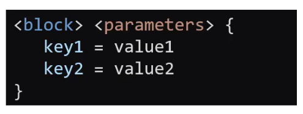
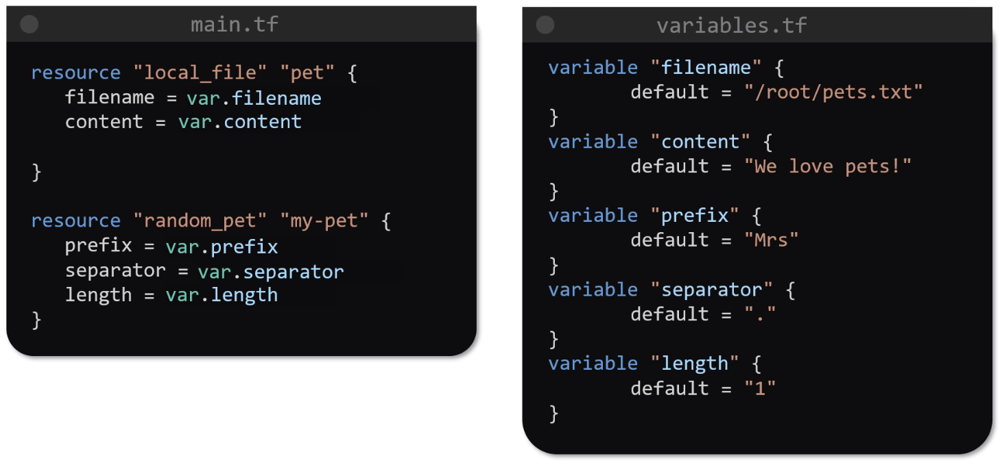

# Terraform <!-- omit in toc -->

I knew nothing when doing this course so the notes will be verbose.

- [1) Infrastructure as Code (IaC)](#1-infrastructure-as-code-iac)
  - [1.1) Types Of IaC](#11-types-of-iac)
  - [1.2) Why Terraform?](#12-why-terraform)
- [2) Hashicorp Configuration Language (HCL) Introduction](#2-hashicorp-configuration-language-hcl-introduction)
- [3) Terraform Basics](#3-terraform-basics)
  - [3.1) Configuration Directory](#31-configuration-directory)
  - [3.2) Providers](#32-providers)
  - [3.3) Variables](#33-variables)

## 1) Infrastructure as Code (IaC)

The tradational infrastructure devlivery model has a lot of different teams working linearly to design, purchase, and build infrastructure. A typical model is:
* The business gives the requirements.
* The business analysts converts these into high level technical requirements.
* The solution architects design the architecture to build and run the requirements.
* The procurement team will order and purchase the required hardware.
* The infratructure teams will then build and configure the hardware in the data centre.
* The application team will build the software.
* The operations team will deploy and maintain the software.

There are a number of disadvantages to this approach.
* It can take a long time to complete this lifecycle.
* Since there are many teams and people involved there is high chance for errors and delays.
* There is little room for automation to speed up the processes.
* Systems are typically built with peak performance in mind which can lead to wasted compute resources. Virtualisation and containerisation has improved this though.

> **NOTE:** On-premise infrastructure can be cheaper or more expensive than the cloud. This depends on the size and complexity of the organisation.

Using virtualisation on-premise or in the cloud gives a big advantage of enabling infrastructure and operations teams access to the platform APIs. **Infrastructure as Code (IaC)** is using code to call these APIs to provsion and configure the servers and software, and this code is checked into the `git` repository so it can be reused. There are a lot of IaC tools.

### 1.1) Types Of IaC

There are 3 types of IaC tools.
1. Configuration management tools, used to control the state of systems.
2. Server templating tools, used to create and configure server software that runs inside of a container or a virtual machine.
3. Provisioning tools, used to create and configure private or public cloud servers.

Ansible and Terraform can both do provisioning. But typically Terraform is used for provisioning and Ansible is used for Configuration Management.

### 1.2) Why Terraform?

It is a free and open source tool that supports multiple public and private cloud environments as well as software stacks. It does this via the product's or service's API through objects called Providers. Terraform supports over 100 Providers.

It uses a simple declarative language to provision and configure things. This language is called **Hashicorp Configuration Language (HCL).**

Terraform goes through 3 stages when applying HCL.
1. Init, initialises the project and identifies the Providers to use.
2. Plan, creates a plan to get to the desired state.
3. Apply, applies the changes to the target so it matches the desired state.

Every object that Terraform manages is called a Resource.

Terraform Cloud and Terraform Enterprise provide additional features.

## 2) Hashicorp Configuration Language (HCL) Introduction

These are text files with a `.tf` file extension. They have a simple structure.

The Resource Type its broken up into 2 sections. The prefix before the underscore is the Provider and the suffix after the underscore is the Resource Type.

There are 4 steps to using Terraform.
1. Write the HCL file.
2. Run the `terraform init` command to parse the `.tf` file and configure the project.
3. Run the `terraform plan` command shows the actions it will perform to create the resource. The output is similar to `diff`, the `+` sybmol shows the lines that will be created.
4. Run the `terraform apply` command will display the execution plan and ask the user to confirm if they want to create the Resource.

`terraform show` can be used to show the Resource that was created.

Terraform creates immutable infrastructure. So updating Resources will typically result in the original Resource being deleted and replaced. We can see this in the output of `terraform plan` and `terraform apply` by the `+/-` showing creation and deletion and the `~` showing the changes being made.

`terraform destory` is used to delete Resources. This will delete all Resources in the `.tf` file.

## 3) Terraform Basics

### 3.1) Configuration Directory

The configuration directoy can have multiple `.tf` files or you can bundle everything into the same file with multiple code blocks. This single file is typically called `main.tf`. There are some other files that Terraform looks for:
* `variables.tf`, contains variables.
* `outputs.tf`, contains output from Resources.
* `provider.tf`, contains Provider definitions.

### 3.2) Providers

`terraform init` downloads and configures plugins for the Providers used within the `.tf` file. Providers are hosted at https://registry.terraform.io and there are 3 types of Providers.
1. Official, these are maintained by Hashicorp.
2. Verified, these are maintained by third parties that are partnered with Hashicorp.
3. Communit, these are maintained by members of Terraform community.

`terraform init` shows which version is being installed. They are installed into `$PROJECT_PATH/.terraform/plugins` and by default the lastest version is installed. But you can freeze verions too.

Terraform uses a similar convention to Docker images. `${REGISTRY_URL}:${ORGANISATION}/{$TYPE}`. Like Docker, the `${REGISTRY_URL}` is optional and it defaults to https://registry.terraform.io

You can use multiple Providers within the same `.tf` file.

The random Provider can be used to generate random output.

### 3.3) Variables

Place your variables into `variables.tf` and reference them inside your `.tf` file.

You can give variables:
* A `default` value.
* A data `type`. The default is `any` if nothing is set.
* A `description`.

There are a variety of data types.

You can enforce data types with data structures.

Set cannot have duplicate elements.

A Tuple can have multiple data types as elements. The defined element types must match.

You can use Objects to create your own data structure by using any data type provided by Terraform.

