# Python <!-- omit in toc -->

I already did the [Automate The Boring Stuff](https://github.com/dallas-hall/learning-python) and [Python Crash Course](https://github.com/dallas-hall/learning-python) textbooks. So the only thing documented here is new or something I didn't know.

## Table of Contents <!-- omit in toc -->

- [1) Certification](#1-certification)
- [2) Literals](#2-literals)
- [3) Operators](#3-operators)
- [4) Strings](#4-strings)
- [5) Bitwise Operators](#5-bitwise-operators)
  - [5.1) Conjunction (AND) Example](#51-conjunction-and-example)
  - [5.2) Disjunction (OR)Example](#52-disjunction-orexample)
  - [5.3) Exclusive Or (XOR) Example](#53-exclusive-or-xor-example)
  - [5.4) Negation (NOT) Example](#54-negation-not-example)
  - [5.5) Bitwise Operation Shortcuts](#55-bitwise-operation-shortcuts)
- [6) Bit Shifting](#6-bit-shifting)
  - [6.1) Bit Shifting Right Example](#61-bit-shifting-right-example)
  - [6.2) Bit Shifting Left Example](#62-bit-shifting-left-example)
  - [6.3) Division \& Multiplication](#63-division--multiplication)
- [7) Lists](#7-lists)
- [8) Functions \& Methods](#8-functions--methods)
- [9) Tuples \& Dictionaries](#9-tuples--dictionaries)

## 1) Certification

The [OpenEDG Python Institute](https://pythoninstitute.org/) offers [Python programming certification.](https://pythoninstitute.org/certification-tracks)

## 2) Literals

* You can add `_` to numbers to make them more readable. e.g. `1_000_000`.
* Octal numbers start with `0o`, e.g. `0o123`
* Scientific numbers can be written as number, e, followed by plus or minus, and the amount to shift the decimal. e.g. `1e+2 = 100` and `1e-2 = 0.01`

## 3) Operators

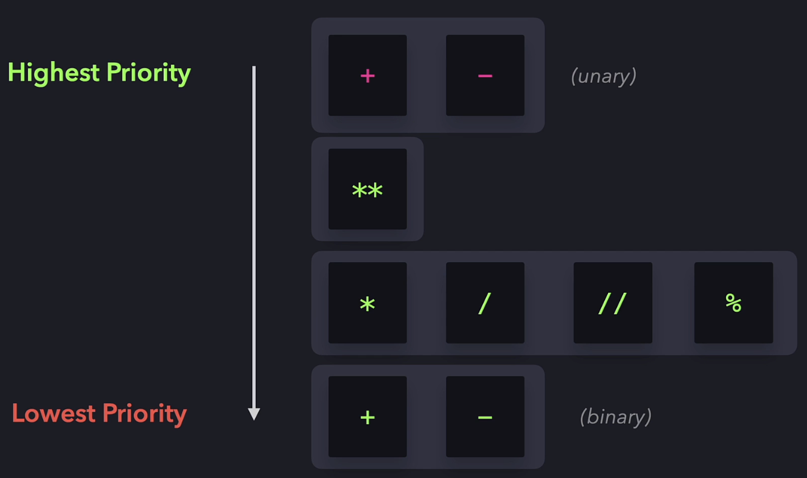

## 4) Strings

Multiplying a string by 0 or negative number returns an empty string.

## 5) Bitwise Operators

Bitwise operators are characters that represent actions (bitwise operations) to be performed on single bits. In Python there are:
* `&` conjunction (AND), 1 and 1 is 1. Everything else is 0.
* `|` disjunction (OR), two 0s is 0. Everything else is 1.
* `^` exclusive (XOR), 0 and 1 or 1 and 0 is 1. Everything else is 0.
* `~` negation (NOT), returns 1 for every 0 and 0 for every 1.

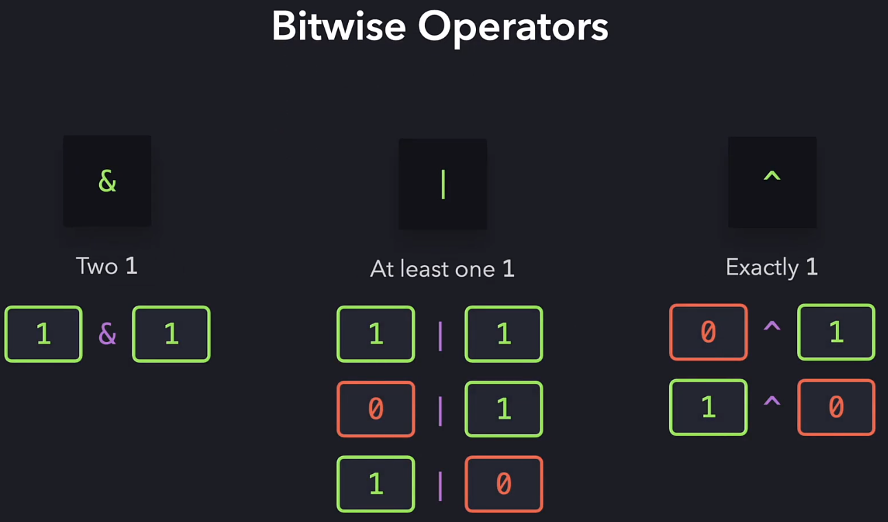

### 5.1) Conjunction (AND) Example

Here is an example of `15 & 22 = 6`

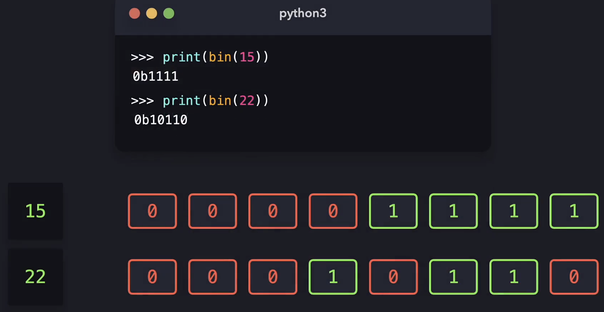

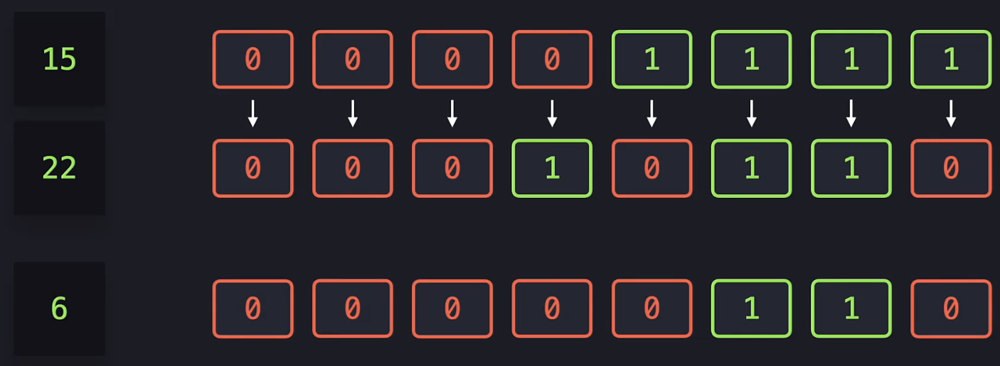

### 5.2) Disjunction (OR)Example

Here is an example of `15 | 22 = 31`

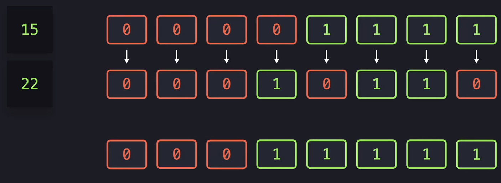

### 5.3) Exclusive Or (XOR) Example

Here is an example of `15 ^ 22 = 25`

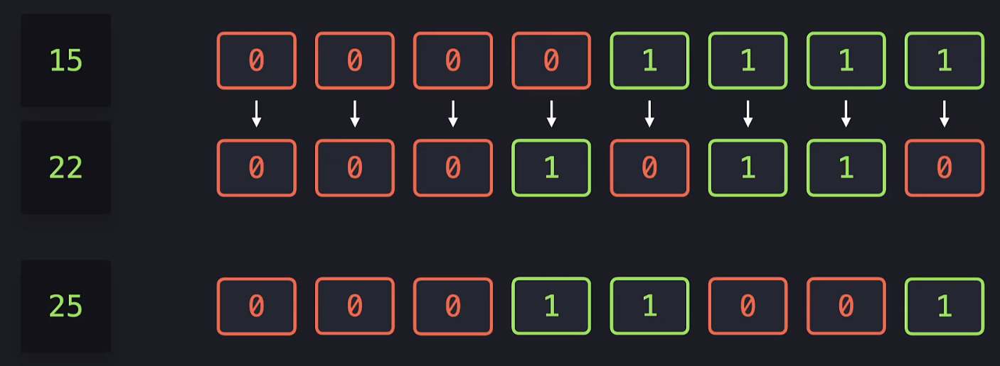

### 5.4) Negation (NOT) Example

Here is an example of `~22 = -23`

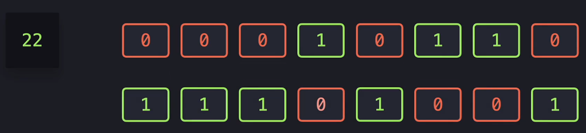

### 5.5) Bitwise Operation Shortcuts

Like arithmetic, there are bitwise operation shortcuts.

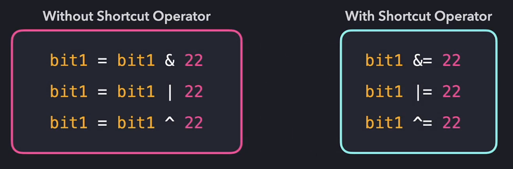

## 6) Bit Shifting

The bit shifting operators do exactly what their name implies. They shift bits.
* `>>` move all the bits to the right by *n*.
* `<<` move all the bits to the left by *n*.

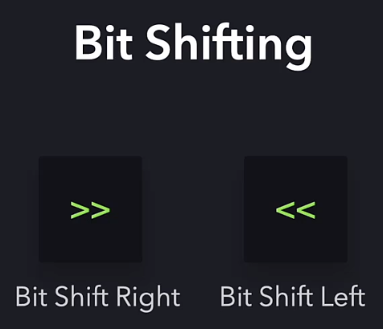

### 6.1) Bit Shifting Right Example

Here is an example of `22 >> 1 = 11`. We are shifting the bits to the right by 1 place. Bit shifting right by 1 is dividing by 2.

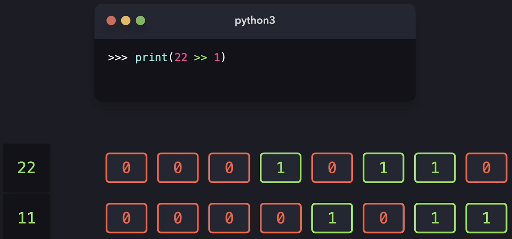

### 6.2) Bit Shifting Left Example

Here is an example of `22 << 1 = 44`. We are shifting the bits to the right by 1 place. Bit shifting left by 1 is mutliplying by 2.

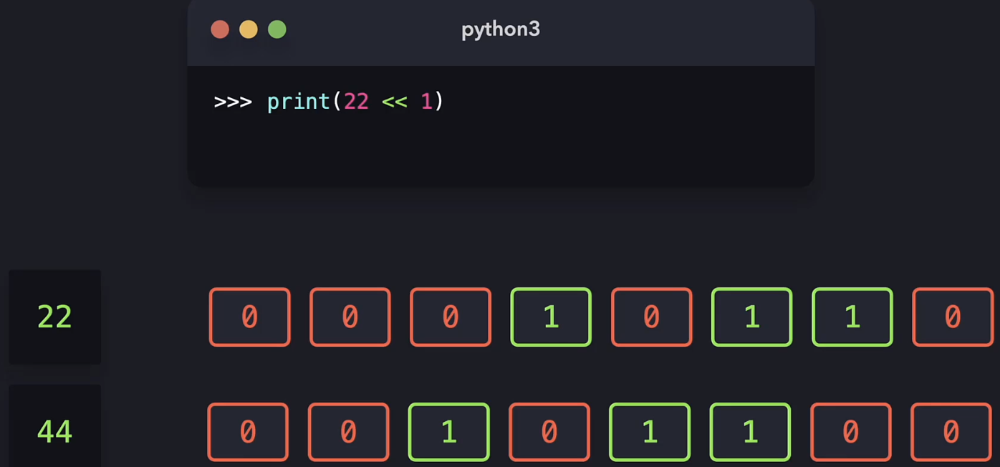

### 6.3) Division & Multiplication

You can use the left shift for division and the right shit for multiplication. e.g.
* Bit shifting right by 1 is dividing by 2.
* Bit shifting right by 2 is dividing by 4. etc.
* Bit shifting left by 1 is mutliplying by 2.
* Bit shifting left by 2 is mutliplying by 4. etc

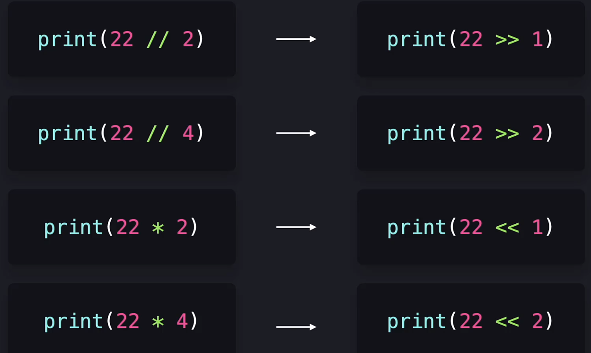

## 7) Lists

`my_list[::1]` will display the entire list in steps of 1.

`my_list[::-1]` will reverse the list and display the entire list in steps of 1.

There is easy shortcut code to swap list items without using a temporary variable.

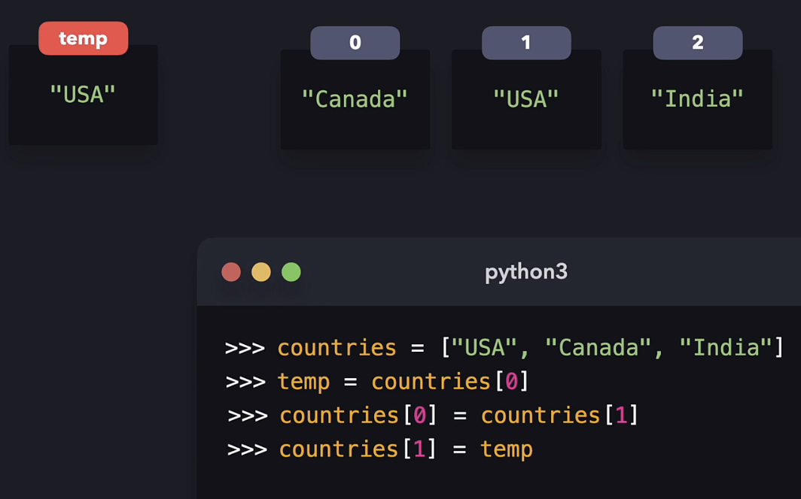

vs

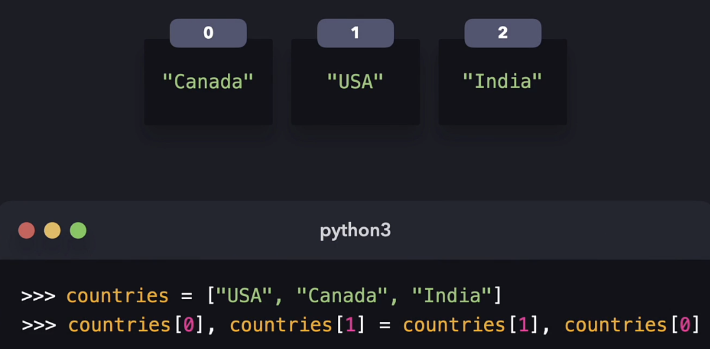

Python list variables store the memory address of the list location. Shallow and deep copies apply.

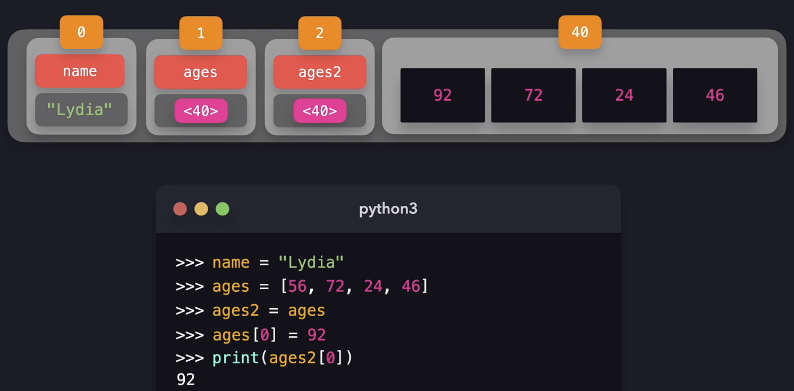

Slicing a list will create a new list. `a[start:stop:step]`
* The first number is the starting index which is included. The default is 0, the start of the list.
* The second number is the final index which isn't included. The default is the length of the list.
* The third number is how many indices to jump. The default is 1.

Some [common list operations](https://stackoverflow.com/questions/509211/how-slicing-in-python-works). The step value can be used with any of these.
* `a[start:stop]`, items start through stop-1.
* `a[start:]`, items start through the rest of the array.
* `a[:stop]`, items from the beginning through stop-1.
* `a[:]`, a copy of the whole array.

Positive numbers count from the start of the list and negative numbers count from the end of the list.
* `a[-1]`,  last item in the array.
* `a[-2:]`, last two items in the array.
* `a[:-2]`, everything except the last two items.

Step can be negative too.
* `a[::-1]`,  all items in the array, reversed.
* `a[1::-1]`,  the first two items, reversed.
* `a[:-3:-1]`, the last two items, reversed.
* `a[-3::-1]`, everything except the last two items, reversed.

Python is kind to the programmer if there are fewer items than you ask for as it will return an empty list and not an error.

`a[start:stop:step]` is the same as `a[slice(start, stop, step)]`.

A 2d array is called a matrix. A 3d array is called a cube.

## 8) Functions & Methods

Python fuctions are used on their own and methods are coupled to data.

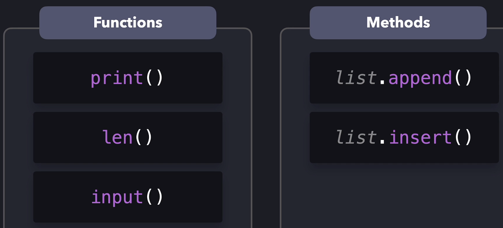

Python will always `return None` if nothing is explicitly returned.

If you have a local variable that has the same identifier as a global variable, Python will use the local one when the scope is local. Python will use the global one when the scope is global.

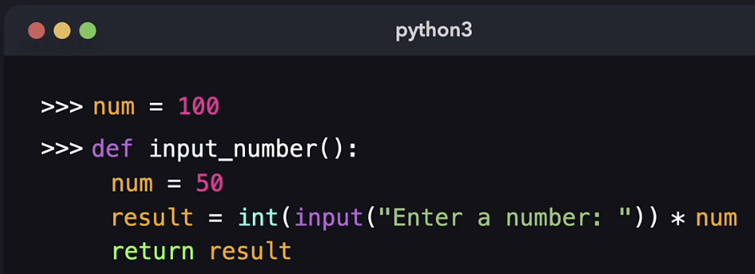

Adding the `global` keyword before defining a local variable will make it a global variable.

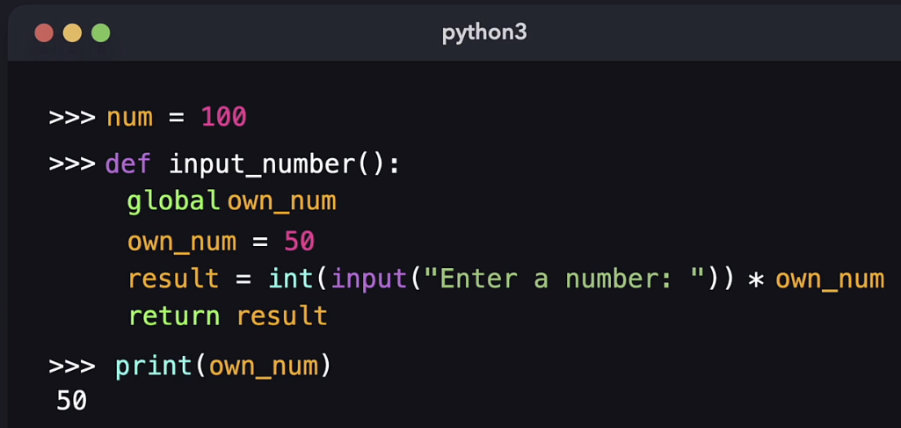

## 9) Tuples & Dictionaries

A tuple is an immutable list that has an order and allows duplicates. It can be written as:
* `my_tuple = (1,)`
* `my_tuple = 1,`
* `my_tuple = (1,2,3)`
* `my_tuple = 1,2,3`

The elements with a tuple can be of any data type.

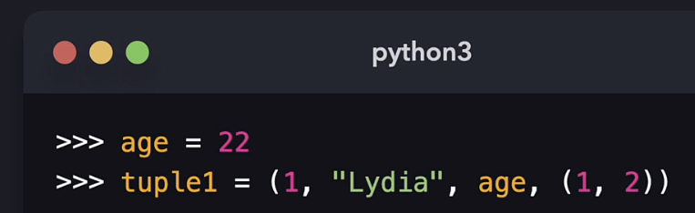
