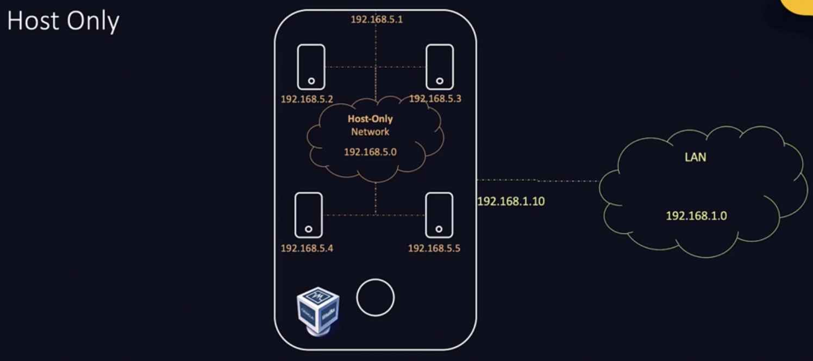

# Lab Environments <!-- omit in toc -->

I already did the [Ansible Up & Running](https://github.com/dallas-hall/learning-ansible) 2nd & 3rd edition textbooks, [Docker For Beginners](https://github.com/dallas-hall/learning-containers-and-orchestration/tree/main/docker/for-beginners), and [CKAD](https://github.com/dallas-hall/learning-containers-and-orchestration/tree/main/kubernetes/02.applications-developer) which covers a lot of this.
## Table of Contents <!-- omit in toc -->

- [1) Virtual Machines (VMs)](#1-virtual-machines-vms)
- [2) Virtual Box](#2-virtual-box)
- [3) Vagrant](#3-vagrant)

## 1) Virtual Machines (VMs)

Create your lab environment using VMs, either in the cloud or on your on computer.

It will be easier to create your own type 2 hypervisor for the VM.

## 2) Virtual Box

Virtual Box is a popular app for creating VMs at home.

https://www.osboxes.org/ contains some prebuilt and preconfigured VMs for Virtual Box or VMWare.

Virtual Box has a variety of networking options, you can configure 4 interfaces which can use any combination of networking options. There are 4 networking options.

**Host only** networking is when a virtual network is created on the host and connectivity is only available to interfaces and VMs or containers within the host. The VM Host has a virtual ethernet interface `vboxnet0`to access this network. There is no internet connectivity with this.

**Network address translation (NAT)** networking is similar to a host only network except egress traffic to outside connectivity is allowed. The IP addresses are changed when crossing network boundaries.

There is NAT networking and NAT. **Plain old NAT** will not create a network for the VMs and the VM Host will handle networking. This is the default.

The **bridge network** is an exention of the LAN. The LAN is always there so the VMs just need to connect to it to get allocated an IP address. This will allow ingress and egress traffic.

Internet connectivity is available with all the networking options but for Host Only networks you need to enable IP forwarding between the physical network interface which has internet access and the virtual network interface that has host only network access. This has security implications though and is typically turned off by default.

Port forwarding is needed so traffic from the VM Host and go into the VM Guest.

## 3) Vagrant

This tool can be used to automate all the tasks manually done in Virtual Box.
